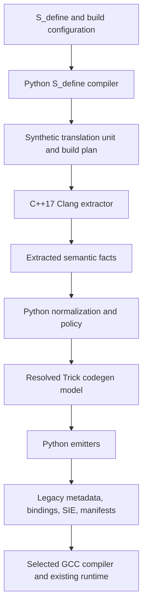

# Trick ICG Rewrite Plan

**Status:** Draft for review\
**Research baseline:** `nasa/trick` at `3ad6b23e52972024093ff499494537109045ab77`; `jdeans289/icg2` at `e43fd867ee84f9ca2962ec8ff8e357399a6ca0c6`\
**Revision:** 2026-09-05 — revised minimums and LLVM 15–17 findings\
**Minimum toolchain:** LLVM/Clang 17, GCC 8.5, C++17, Python 3.11, Java 17, SWIG 4.1\
**Platform policy at cutover:** Debian 12 and Ubuntu 22.04 are no longer supported\
**Support policy:** GCC 8.5 is required, not best effort; GCC 12 remains an additional reference/test compiler. SWIG 4.1 is the transitional minimum until binding replacement.

This revision supersedes the original LLVM 14 / GCC 12-required / Python 3.10 baseline. Repository findings remain pinned to the commits above; the new toolchain combinations and API prototypes have not yet been built or benchmarked.

## 1. Executive proposal

Rewrite ICG as a small code-generation platform rather than as one executable that parses C++ and directly writes every build artifact.

The recommended shape is:

1. A C++17 Clang extractor parses each translation unit once and emits a versioned, Trick-owned semantic intermediate representation (IR).
2. Python 3.11 owns orchestration, diagnostics presentation, caching, deterministic file output, and most generators.
3. Independent generators consume the same IR for:
   - the existing `ATTRIBUTES` / `ENUM_ATTR` / `io_src` contract;
   - replacement Python bindings;
   - SIE metadata;
   - semantic dependency and build manifests;
   - later, a typed runtime-metadata API.
4. The current runtime contract is preserved first. MemoryManager, REF2, checkpoint algorithms, variable server behavior, and data recording are not rewritten at the same time.
5. The Perl configuration/build path is replaced incrementally with Python. The final default simulation build should execute neither Perl nor SWIG.
6. The useful ideas in `icg2`—owned type descriptions, extractor/generator separation, and typed runtime algorithms—are retained. Its raw `clang -ast-dump=json` ingestion, shell command construction, string-only type model, `offsetof` dependence, and simultaneous runtime replacement are not adopted.

The first production milestone is deliberately conservative: a new extractor and Python legacy emitter generate code that the current Trick runtime consumes. This creates a safe seam before changing runtime metadata or Python bindings.

## 2. Goals and non-goals

### Goals

- Make LLVM 17 the minimum/reference Clang API baseline and GCC 8.5 the minimum supported simulation compiler.
- Require C++17 for the new C++ code and generated C++ sources; require Python 3.11 for the new Python package and CLI.
- Parse C++ once and share a structured semantic model among all code generators.
- Preserve the existing simulation-facing behavior while migration is in progress.
- Eliminate silent compiler-argument loss and make parse conditions reproducible.
- Replace codegen-related Perl with Python or absorb the behavior into C++ where it is inherently Clang-facing.
- Replace the SWIG pipeline with generated modern bindings while preserving the existing Python API and lifetime behavior.
- Produce deterministic outputs, useful diagnostics, dependency information, and an inspectable cache.
- Isolate LLVM APIs so support for a later LLVM release does not spread conditionals through the model and generators.
- Establish explicit performance, compatibility, and real-simulation release gates.

### Non-goals for the initial cutover

- Rewriting MemoryManager, REF2, checkpoint/restore, data recording, or variable server algorithms.
- Redesigning the `S_define` language or requiring old simulations to edit it.
- Removing every Perl program in Trick; only the codegen/build path is in scope.
- Replacing GNU Make or the entire Trick build system. The first build adapter should continue to emit what the existing build consumes.
- Supporting every LLVM release with scattered preprocessor branches.
- Byte-for-byte equivalence of generated source. The requirement is semantic, ABI, build, and runtime equivalence.
- Fixing every historical metadata limitation in the first vertical slice.

## 3. What the current code says the boundary really is

The current ICG does substantially more than AST extraction:

| Current area | Responsibilities found | Rewrite consequence |
|---|---|---|
| [`Interface_Code_Gen/main.cpp`](https://github.com/nasa/trick/blob/3ad6b23e52972024093ff499494537109045ab77/trick_source/codegen/Interface_Code_Gen/main.cpp) | Manually configures a `CompilerInstance`, language/target/preprocessor/Sema, old-to-new LLVM shims, and a permissive CLI | Replace with a normal tooling action and a narrow compiler-adapter layer |
| Visitors and value classes | Discover records, bases, fields, bitfields, templates, enums, comments, layout, construction/destruction capability | Replace mutable/raw-pointer state with an owned semantic graph |
| [`PrintAttributes.cpp`](https://github.com/nasa/trick/blob/3ad6b23e52972024093ff499494537109045ab77/trick_source/codegen/Interface_Code_Gen/PrintAttributes.cpp) | Selection policy, output placement, freshness, Makefiles/lists, SIE resources, class/enum maps, exclusions | Split policy, emitters, and filesystem/build adapters |
| [`PrintFileContents10.cpp`](https://github.com/nasa/trick/blob/3ad6b23e52972024093ff499494537109045ab77/trick_source/codegen/Interface_Code_Gen/PrintFileContents10.cpp) | Emits legacy metadata, offsets, lifecycle thunks, STL helpers, and registries | Preserve as the first compatibility backend, then retire incrementally |
| `trick-CP` and helpers | Parse `S_define`, produce synthetic sources, run ICG/SWIG, resolve source/library dependencies, generate Makefiles | Replace with a Python coordinator and typed build plan |
| SWIG helpers | Independently re-parse C++ with Perl regex/balancing logic and generate bindings | Move binding semantics into the shared IR and a binding backend |
| Runtime consumers | Treat `ATTRIBUTES.offset`, nested attribute pointers, lifecycle symbols, and STL callbacks as an ABI | Keep stable during the first rewrite; modernize in a separate runtime stream |

`icg2` correctly recognized that generated reflection and runtime type operations deserve explicit models. It also demonstrates the value of type-directed visitors. However, its ICG shells out to `clang -ast-dump=json`, filters an undocumented AST dump, and then reconstructs types from strings. Its `DataTypes` tree is a new MemoryManager/runtime design, not merely an ICG rewrite. Those two changes should not be coupled in the production migration.

## 4. Proposed ownership boundaries

“ICG” should be the semantic core. “Trick codegen” should be the umbrella product containing ICG plus its generators and command-line experience.

| Component | Owns | Must not own |
|---|---|---|
| **C++ semantic extractor (`trick-icg-extract`)** | Clang invocation, AST/preprocessor traversal, declaration/type/source facts, include graph, raw annotations, semantic diagnostics, IR serialization | Makefile formatting, runtime algorithms, output-directory policy, SWIG behavior, shell orchestration |
| **Owned semantic IR** | Stable Trick vocabulary for types/declarations/annotations/capabilities, provenance, schema version | Clang pointers/classes, Python binding-library classes, runtime addresses |
| **Python codegen package (`trick_codegen`)** | Public CLI, configuration, process orchestration, caching, policy, deterministic emission, legacy/SIE/binding/build backends | C++ parsing by regex, executing `S_define` contents, runtime ownership |
| **`S_define` compiler** | Lex/parse the Trick configuration DSL, preserve embedded C++ slices, produce a typed config AST and synthetic sources/build plan | Clang AST interpretation, runtime metadata |
| **Build adapter** | Convert the build plan and dependency manifest to current GNU Make fragments/link lists | Deciding C++ semantics or scraping generated C++ |
| **Runtime metadata API** | Addressing, lifecycle operations, type registry, checkpoint/restore/lookup consumers | LLVM, Clang, Python, build orchestration |
| **Units service** | Canonical unit aliases, validation, conversion | AST traversal and file generation |

The units annotation parser belongs in codegen policy, but UDUNITS initialization/conversion and the canonical alias table should be a reusable service rather than being compiled directly into the extractor.

## 5. Target pipeline

Important properties:

- The extractor parses a translation unit once, even when several outputs are requested.
- The extractor has no knowledge of output directory layout beyond its own IR/diagnostic output.
- Backends are independently testable pure transformations where practical.
- The build coordinator passes argument arrays, never constructed shell command strings.
- Generated sources are compiled by the actual simulation compiler (GCC 8.5 or a supported newer version), so compiler-sensitive operations can move into generated thunks over time.
- Every cache entry records the exact normalized compiler arguments, target, extractor/schema/backend versions, and all discovered inputs.

## 6. Clang interface decision

### Decision

The focused libclang 17.0.6 capability spike found three required gaps: no usable base-offset query, no cursor for an implicit default constructor, and no C API for the elements of an exposed variadic template pack. [ICG-001](architecture/ICG-001-extractor-api.md) therefore selects a narrowly isolated Clang 17 LibTooling implementation. The checked-in probe and results remain reproducible decision evidence.

Retain the C++17 extractor/process boundary and owned IR. Do not maintain two production extractors or parse each translation unit twice.

LLVM distinguishes the stable high-level C API from LibTooling's full AST control ([Clang interface guidance](https://releases.llvm.org/17.0.1/tools/clang/docs/Tooling.html)). The capability prototype, not the interface's name, decides the implementation.

### LLVM 15–17 changes to exploit

| Version | Verified change | Planned application |
|---|---|---|
| 15 | Type-use annotations via `clang::annotate_type`; pack expansion in `clang::annotate` | Optional annotation prototype; retain comments and portable macros |
| 15 | Variable-template-specialization leak and template crash fixes | Automatic frontend robustness; add representative fixtures |
| 16 | `clang_getUnqualifiedType`, `clang_getNonReferenceType` | Structured type normalization without string editing |
| 16 | Deleted-method and copy-/move-assignment queries | Lifecycle and binding capability extraction |
| 16 | Template-argument queries extended to class/struct/partial-specialization cursors | Extract class template arguments semantically |
| 16 | Packed non-POD member and defaulted-special-member ABI rules align more closely with GCC on most targets | GCC layout regression suite, not an assumption of universal agreement |
| 17 | `clang_CXXMethod_isExplicit` | Preserve explicit conversion/constructor policy in binding generation |
| 17 | `clang_createIndexWithOptions`, configurable preamble storage, safer index initialization | Benchmark repeated parsing with explicit per-worker configuration |
| 17 | Dependent-bitfield width-query fix | Handle unevaluable widths explicitly rather than treating them as concrete layout |
| 17 | Multiple-include optimization tolerates null directives outside guards | Automatic, workload-dependent parsing benefit |

Sources: [Clang 15 release notes](https://releases.llvm.org/15.0.0/tools/clang/docs/ReleaseNotes.html), [Clang 16 release notes](https://releases.llvm.org/16.0.0/tools/clang/docs/ReleaseNotes.html), [Clang 17 release notes](https://releases.llvm.org/17.0.1/tools/clang/docs/ReleaseNotes.html). These are opportunities and fixes, not measured Trick performance results.

### Capability acceptance matrix

| Required fact | libclang 17 assessment | Acceptance test |
|---|---|---|
| Fields, enums, access, canonical types, comments, mangling | Existing C API coverage | Compare with legacy fixture output |
| Class template arguments and partial specializations | Expanded in LLVM 16 | Type/integral arguments, aliases, nested specializations, dependent arguments, and packs; no string splitting |
| Deleted methods and assignment operators | New queries in LLVM 16 | Explicitly/implicitly deleted operations, access, and generated GCC compilation |
| Explicit constructors/conversions | New query in LLVM 17 | Verify emitted binding policy |
| Immediate field offset, size/alignment, bit width | Available, with dependent-width fix | Packed/anonymous/bitfield cases and negative query results |
| Base/virtual-base layout for flattened legacy metadata | Blocker: base cursors return `-1` from the field-offset query | Reproduce current inheritance semantics through LibTooling and GCC layout probes |
| Implicit special members | Blocker: records requiring an implicit constructor expose no constructor cursor | Match current `needsImplicitDefaultConstructor` behavior through LibTooling |
| Variadic pack elements | Blocker: the specialization exposes one opaque pack argument | Extract each element through LibTooling without string splitting |
| Friend access and remaining source fidelity | Focused friend/access case passes; real-header coverage remains incomplete | Exercise real legacy headers and future binding requirements |

The existing ICG uses base/vbase layout and implicit-constructor information directly in [ClassVisitor.cpp](https://github.com/nasa/trick/blob/3ad6b23e52972024093ff499494537109045ab77/trick_source/codegen/Interface_Code_Gen/ClassVisitor.cpp). The new deleted-method query alone does not prove construction is legal, and improved template queries do not prove complete pack support.

### Containment rules

- No Clang/LLVM types or handles escape into the owned IR, Python policy, generators, or runtime.
- Isolate all frontend API/version knowledge in one adapter.
- With libclang, use index/TU/cursor APIs with RAII and explicit disposal.
- With LibTooling, use `ASTFrontendAction`, `ASTConsumer`, `RecursiveASTVisitor`, `PPCallbacks`, and compilation commands; do not manually recreate frontend setup.
- Use package discovery, actual resource-directory discovery, and explicit library selection rather than ancient hardcoded `llvm-config` lists or SONAME assumptions.
- Record the API/library version and capabilities in `doctor` and IR provenance.

### Required Phase 0 spike

Test virtual/diamond inheritance, private/protected friend access, implicit/deleted/default constructors and destructors, class/partial template specializations and packs, macros/comments, anonymous types, and dependent bitfields. Compile generated operations with GCC 8.5 and GCC 12. Record each result as supported, unsupported, or supported with an explicit portable generated operation.

The spike documents the smallest concrete blockers and selects LibTooling. A strict C-API-only constraint would require earlier runtime addressing and type-model changes; that would be a separate scope decision.

## 7. Compiler invocation and GCC/Clang mismatch

The current CLI accepts many GCC flags but drops unknown options and all `-W*` options. That can cause ICG to parse a different program than GCC builds. The rewrite must make argument handling auditable.

1. The build planner records the real selected GCC compile command for the synthetic translation unit.
2. An explicit argument normalizer classifies every argument as:
   - semantic and passed to Clang unchanged;
   - GCC-driver/link/code-generation-only and omitted with a recorded reason;
   - translated to a documented Clang equivalent;
   - unsupported/unknown, which is an error by default.
3. A temporary compatibility mode may downgrade selected unknown arguments to warnings, but diagnostics and the IR fingerprint still record them.
4. Target, data model (`-m32`/`-m64`), language dialect, defines, forced includes, include order, sysroot, and ABI-affecting flags are never silently changed.
5. Parse errors fail the build. Warnings remain visible and classified; maintain an explicit strict mode/allowlist rather than suppressing all warnings or making every new frontend warning fatal for old simulations.

Clang parsing GCC-targeted headers remains a fundamental cross-frontend risk, especially around compiler predefined macros and layout. Mitigations are:

- record both the Clang parse fingerprint and GCC build fingerprint;
- compile generated conformance probes with GCC 8.5 and GCC 12 for high-risk layouts;
- maintain fixtures for conditional code using compiler/version macros;
- move layout and lifecycle truth into GCC-compiled generated traits/thunks wherever the runtime contract permits;
- fail clearly when the parser and build target are incompatible.

Clang 16 changed default C++ mode to GNU C++17 and resource-directory naming to major-version-only paths. Always set the intended dialect and query the matching Clang resource directory. Its stricter C diagnostics also belong in the old-simulation migration tests ([Clang 16 upgrade notes](https://releases.llvm.org/16.0.0/tools/clang/docs/ReleaseNotes.html#potentially-breaking-changes)).

## 8. Owned semantic IR

The IR is the key architectural boundary. It should be a versioned Trick document, not Clang's JSON AST dump.

### Representation

- Canonical JSON for the first implementation: inspectable, easy to diff, directly usable from Python, and suitable for golden tests.
- A checked-in JSON Schema plus C++17 value types and Python 3.11 dataclasses.
- Integer/string IDs and references form a graph; types are not duplicated recursively in every field.
- Canonical ordering and path normalization make output reproducible.
- A compact encoding can be added later only if measurements show JSON parse/size is material.

Use two logical layers rather than mixing frontend facts with generator policy:

1. **Extracted facts:** serialized by C++; contains declarations, structured types, source/include provenance, raw comments/Clang annotations, frontend semantic properties, and diagnostics.
2. **Resolved codegen model:** produced by Python normalization; contains typed Trick annotations, selection/exclusion results, backend capabilities, and stable reason codes.

The extracted-facts document is the expensive parse cache. The resolved model may also be dumped for debugging and golden tests. “IR” below refers to this versioned pair unless a distinction matters; emitters consume the resolved model.

### Minimum schema

| Group | Required data |
|---|---|
| Provenance | Schema/tool version, translation unit, complete normalized argv, target triple/data model, working directory, environment inputs, content/dependency digest |
| Files | Stable file IDs, user/Trick/system classification, include graph, spelled and real paths without embedding machine-specific paths in generated output |
| Source | Spelling and expansion locations/ranges, macro provenance, raw comment source span |
| Declarations | Stable ID/USR where available, kind, qualified/unqualified name, lexical/semantic parent, definition/redeclaration relation, visibility/access, origin |
| Types | Structured kind, qualifiers, pointers/references, arrays and extents, records/enums, functions, aliases, template specialization and arguments, written spelling and canonical identity |
| Records | Completeness, struct/class/union, bases and virtuality/access, fields, nested declarations, abstract/POD/standard-layout/trivial facts available from the frontend |
| Fields | Static/member, access, bitfield width, type, array shape, immediate layout facts, mutability, annotations, inherited provenance |
| Callables | Constructors/destructor/methods/free functions, parameters, defaults, overload identity, cv/ref/noexcept/static/virtual/pure/final/deleted facts needed for bindings |
| Enums | Scoped/signedness/underlying type/enumerators and exact integral values |
| Variables | Globals/static members, type, namespace/module placement, mutability and binding policy |
| Annotations | Parsed Trick I/O/checkpoint policy, units, description, include/exclude, Python module/name, ownership/lifetime hints, legacy raw text and diagnostics |
| Capabilities | Derived reasons such as legacy-printable, bindable, constructible, destructible, checkpointable; every negative result includes a stable reason code |

Layout values emitted by Clang are tagged with their frontend/target fingerprint. They are compatibility data, not timeless truth.

### Annotation migration

Support the current comment grammar first. Normalize it once into typed annotations so legacy ICG and SWIG semantics do not remain separate parsers. Add an optional `TRICK_ANNOTATE(...)` macro backed by a Clang annotation for new code, while GCC sees a harmless/no-op form. Do not require existing simulations to convert comments.

Prototype type-use annotations separately from declaration annotations: ownership attached to a pointer use must not disappear during canonicalization. Verify extraction through the chosen API and macro behavior under GCC 8.5 before committing to this syntax.

Ambiguous or malformed annotations produce source-located diagnostics rather than silently choosing a default. Legacy behavior can be preserved behind a named compatibility rule with a test.

## 9. Generators

### 9.1 Legacy metadata backend — first and mandatory

The first backend reproduces the current external contract:

- per-header `io_*.cpp` outputs and expected file placement;
- `ATTRIBUTES` and `ENUM_ATTR` arrays;
- class and enum registry population;
- `init_attr*`, `sizeof`, allocation, destruction, and delete entry points;
- STL checkpoint/restore/clear/access callbacks;
- units registration;
- current output/link/dependency manifest information.

It should initially favor semantic equivalence over source equivalence. A semantic comparison tool should parse old and new generated metadata into normalized records and report deliberate differences.

Do not modernize the runtime ABI in this backend. That separation is what permits old large simulations to validate the new extractor independently.

### 9.2 Python binding backend

Binding generation belongs in the codegen platform because it needs the same records, functions, templates, namespaces, annotations, and selection rules. It must not run a second Perl/C++ parser over the headers.

The backend interface should not expose pybind11 or nanobind types. Run the high-risk compatibility suite against both candidates, then freeze one implementation. The conservative default is pybind11 until nanobind passes all of the following:

- borrowed MemoryManager-owned objects and pointer invalidation after delete/reallocation;
- parent/child lifetime coupling and references to members;
- raw pointers, fixed and multidimensional arrays, strings, and STL containers;
- global variables, static members, nested classes/enums, and namespaces;
- templates and explicit instantiations used by existing simulations;
- derived classes, virtual methods/trampolines, and multiple inheritance where the current API permits it;
- dynamic Python attributes and existing module/import names;
- units-aware get/set behavior and existing Python exceptions.

Both libraries offer explicit ownership policies, inheritance, and virtual-method mechanisms; those mechanisms still require deliberate generated policy rather than automatic defaults ([pybind11 classes and inheritance](https://pybind11.readthedocs.io/en/stable/advanced/classes.html), [nanobind classes](https://nanobind.readthedocs.io/en/latest/classes.html), [nanobind ownership](https://nanobind.readthedocs.io/en/latest/ownership.html)).

The migration runs SWIG 4.1-generated bindings and the new backend in separate comparable test processes under Python 3.11, avoiding accidental cross-registration of the same C++ types. Both sides use the same Python API tests. Pin the selected replacement library to a version verified with GCC 8.5; a compiler-floor violation is not best effort. Remove `convert_swig` and `make_makefile_swig` only after those tests pass on real simulations.

### 9.3 SIE backend

SIE metadata is another view of the semantic IR. Emit deterministic per-input resources plus an explicit aggregate manifest. Stop appending ad hoc fragments during AST traversal and stop requiring a separate concatenation/scrape pass.

### 9.4 Build/dependency backend

The extractor emits semantic inputs and includes; the S_define compiler emits sources/libraries/jobs. A Python build planner combines them into a versioned build manifest. A GNU Make adapter initially converts that manifest into the filenames the current build expects. This keeps Make compatibility without placing Makefile logic in the semantic extractor.

### 9.5 Trickify mode

`trick-ify` should invoke the same extraction and backend APIs with a library/trickify profile. It should not remain a parallel implementation of header discovery and ICG/SWIG orchestration. Port its CLI wrapper after the simulation path is stable.

## 10. Python 3.11 command-line tooling

Install one public entry point, `trick-codegen`, with narrowly scoped subcommands:

| Command | Purpose |
|---|---|
| `trick-codegen build S_define` | Normal end-to-end simulation codegen; compiles `S_define`, extracts semantics, runs selected backends, and writes the build manifest/adapter files |
| `trick-codegen sdefine compile S_define` | Produce/inspect the typed config AST, synthetic translation unit, and build plan without running ICG |
| `trick-codegen extract --compdb DIR --tu FILE -o IR` | Run only the Clang extractor for debugging and tests |
| `trick-codegen emit --ir IR --backend NAME` | Run one or more backends without reparsing C++ |
| `trick-codegen inspect --ir IR SYMBOL` | Explain a type/declaration and why it was emitted, skipped, or degraded |
| `trick-codegen doctor` | Report resolved LLVM/GCC/Python/Java/SWIG versions, resource/include paths, configuration provenance, and compatibility problems |
| `trick-codegen diff OLD NEW` | Compare normalized metadata or two IR documents during migration |

CLI rules:

- Use Python's standard-library `argparse` initially; avoid a runtime framework dependency for a small command surface.
- Use TOML project configuration via Python 3.11's standard-library `tomllib`; use exception notes for configuration/source context. TOML writing, if needed, is a separate dependency decision ([Python 3.11 changes](https://docs.python.org/3.11/whatsnew/3.11.html)).
- Precedence is explicit: command line, project config, environment compatibility mapping, defaults. `doctor` prints the resolved source of each value.
- Compiler arguments are supplied through a compilation database, response file, or after `--`; they are not reinterpreted as codegen options.
- Human diagnostics go to stderr; machine diagnostics are available as versioned JSON.
- Define stable exit classes: invocation/configuration, parse, policy, generation, external compiler/build, and internal failure.
- Support `--jobs`, `--cache-dir`, `--no-cache`, `--force`, `--dry-run`, `--verbose`, `--diagnostics-format`, and `--why-skipped` consistently.
- All writes use temporary files plus atomic rename and avoid changing a file whose bytes are unchanged.
- Never use `shell=True` or evaluate `S_define`/configuration strings as Python.

During migration, `trick-ICG` and `trick-CP` remain thin compatibility entry points that translate old flags, invoke `trick-codegen`, and emit deprecation diagnostics. New functionality is added only to the new CLI.

## 11. `S_define` and Perl replacement

`S_define` parsing is part of the codegen workflow but not part of the Clang semantic core. Replace the Perl regex/Text::Balanced implementation with a Python 3.11 package containing:

- a lexer that understands comments, strings, escapes, and balanced C/C++ delimiters;
- a small top-level parser for Trick constructs such as integration loops, jobs/classes, instantiation, collect/vcollect, user/header/inline code, `create_connections`, compiler directives, job class order, and dependency/default-data annotations;
- Python dataclasses for a source-located configuration AST;
- an emitter for `S_source.hh` / `build/S_source.cpp` and a typed build plan;
- error recovery that reports more than the first malformed construct where safe;
- preservation of embedded C++ as source slices/tokens, not evaluation or an attempted second C++ grammar.

A handwritten scanner plus recursive-descent top-level parser is the likely lowest-dependency fit because the language intentionally embeds C++. A grammar library should be chosen only if a corpus spike shows it makes recovery and maintenance materially better.

### Perl disposition

| Existing program/module | Disposition | New owner |
|---|---|---|
| `bin/trick-CP` | Replace with compatibility shim, then remove | Python CLI/orchestrator |
| `configuration_processor` | Replace | Python S_define compiler |
| `parse_s_define.pm`, `s_source.pm` | Replace; do not transliterate regex-for-regex | Python lexer/parser/model/emitter |
| `make_makefile_src`, `get_lib_deps.pm` | Replace | Python build planner and GNU Make adapter |
| `make_makefile_swig`, `convert_swig` | Delete after binding parity | Shared IR + binding backend |
| `html.pm` | Absorb relevant comment/header annotations | Shared annotation parser |
| `get_paths.pm` and codegen portions of `gte.pm` | Replace with typed configuration/path discovery | Python configuration module |
| `sie_concat` | Replace with manifest-driven aggregation | SIE backend |
| `bin/trick-ify` and duplicated `trickify.mk` orchestration | Port/reduce to a profile of the common CLI | Python orchestrator/build adapter |
| `dd_convert`, GUI/data-products/checksum/test Perl | Keep outside this project; audit/deprecate separately | Existing owners |

The final cutover criterion is “no Perl in the default codegen/build path,” not “no Perl anywhere in Trick.”

## 12. Modern C++17 implementation policy

- Use RAII and value semantics. `std::unique_ptr` owns polymorphic objects; avoid naked owning pointers and manual `clear*` ownership transfers.
- Use `std::optional`, `std::variant`, scoped enums, `std::string_view`, and `std::filesystem` where they simplify the model.
- Separate immutable extracted facts from derived policy decisions and emitted text.
- Return explicit result/error types at module boundaries; do not mix diagnostics with `std::cout` debugging.
- Use stable declaration/type IDs rather than pointers as graph identity.
- Make traversal state translation-unit-local. No mutable process-global maps or UDUNITS initialization in field constructors.
- Compile the required lane with `-Wall -Wextra -Wpedantic`; use `-Werror` only in the GCC 12 maintained lane.
- Explicitly request `cxx_std_17`; do not depend on any compiler's default dialect.
- Use LLVM/Clang 17 CMake configuration packages and normal targets. Remove support code for LLVM 3-era APIs rather than wrapping it.

GCC 8.5 compatibility is mandatory for the new C++ code and generated sources. Detect/link `stdc++fs` when needed and test C++17 library facilities on the floor. Localized portability helpers are acceptable; do not introduce GCC 12-only builtins or C++20/23 features without compatible implementations.

## 13. Toolchain and compatibility policy

| Component | Minimum and scope |
|---|---|
| LLVM/Clang | 17; matching headers/libraries/resource headers for extraction |
| GCC | 8.5; supported floor for Trick, the extractor source, and generated C++ |
| Language | C++17, explicitly selected |
| Python | 3.11; CLI, generators, embedded interpreter/bindings where applicable |
| Java | 17; Java tools build and run at this floor, outside ICG core |
| SWIG | 4.1; transitional build-time dependency until the replacement backend passes parity |
| Platforms | Debian 12 and Ubuntu 22.04 support ends at the planned cutover |

Dropping those distributions is a support-policy decision, not proof that every remaining distribution's default packages satisfy every minimum. Phase 0 must document installation sources and test exact package combinations for each supported platform.

| CI lane | Configuration | Gate |
|---|---|---|
| Minimum stack | LLVM 17 + GCC 8.5 + Python 3.11; Java 17 and SWIG 4.1 where used | Blocking PR build, focused runtime/binding tests, and release corpus |
| Additional reference | LLVM 17 + GCC 12 + Python 3.11 | Blocking integration and real-simulation tests |
| Intermediate GCC coverage | GCC 9–11 with baseline dependencies | Scheduled rotation; regressions are support bugs, not dismissed as best effort |
| Sanitizers | Supported modern instrumentation compiler; LLVM 17 extraction | Blocking focused memory/lifetime tests; supplements rather than replaces GCC 8.5 |
| Newer dependency/platform coverage | Explicitly selected supported combinations | Blocking before advertising support; reconnaissance may initially be non-blocking |
| Java/SWIG transition | JDK/runtime 17; SWIG 4.1 output compiled and exercised with Python 3.11/GCC 8.5 | Required until the corresponding dependency is removed |

LLVM 17's documented host floor is GCC 7.4, below GCC 8.5 ([LLVM 17 requirements](https://releases.llvm.org/17.0.1/docs/GettingStarted.html#host-c-toolchain-both-compiler-and-standard-library)). That does not guarantee an arbitrary prebuilt LLVM package runs with GCC 8.5-era libstdc++. Verify shared-library dependencies, C++ ABI settings, headers, resource headers, and startup on the oldest supported environment.

Before cutover, choose an LLVM distribution policy:

1. **Pinned extractor:** distribute a tested LLVM 17-linked process with compatible runtime dependencies.
2. **System LLVM:** test LLVM 17 and the newer versions used by supported platforms. With LibTooling, isolate version-specific adapters; with libclang, still test capabilities and semantic output across versions.

Java modernization is limited here to enforcing the 17 floor, build configuration (for example `--release 17` where appropriate), packaging, and smoke tests. Do not move Java tools into ICG merely to centralize dependencies. SWIG remains a temporary dependency, not a new permanent backend commitment.

## 14. Migration plan and exit gates

### Phase 0 — Freeze contracts and answer high-risk questions

Deliverables:

- inventory every current generated file, symbol, Make fragment/list, environment variable, CLI flag, annotation, and runtime consumer;
- capture small, medium, and real large/old simulation corpora with reproducible build commands;
- establish stage-level wall time, CPU, peak RSS, generated bytes/files, file churn, generated compile time, and link time baselines;
- add normalized snapshots of current `ATTRIBUTES`, enums, lifecycle/STL helpers, SIE, `S_source`, and Python behavior;
- complete the libclang 17-first capability, GCC 8.5/12 layout, S_define-parser, and binding-backend spikes;
- validate exact platform packages and the minimum Python 3.11 / Java 17 / SWIG 4.1 stack, including GCC 8.5 compatibility;
- approve the initial ADRs listed in Section 18.

Exit gate: the compatibility contract and representative corpus are reviewed; no implementation begins on assumptions about undocumented output.

### Phase 1 — C++ extractor and IR vertical slice

Deliverables:

- C++17 extractor built against LLVM/Clang 17 using the Phase 0-selected libclang or LibTooling API;
- exact/recorded compiler-argument normalization and compilation-database support;
- owned IR schema and serializers/readers;
- records, enums, aliases, structured types, inheritance, fields/bitfields/arrays, source provenance, comments/annotations, includes, and diagnostics;
- focused parity fixtures for every historical ICG bug category found in the repository history;
- `extract`, `inspect`, and `doctor` CLI paths.

Exit gate: the new IR semantically describes the fixture corpus and selected real simulation translation units without changing the build.

### Phase 2 — Legacy generator parity

Deliverables:

- Python legacy emitter for the complete current metadata/lifecycle/STL contract;
- deterministic output writer and normalized old-vs-new comparison tool;
- dual-generation mode in CI: old ICG remains authoritative while new output is compiled and tested;
- GCC 8.5 and GCC 12 layout probes for inheritance, virtual inheritance, bitfields, packed non-POD members, defaulted special members, arrays, and compiler-conditionals.

Exit gate: new output compiles/links with GCC 8.5 and GCC 12, passes the runtime-focused and real-simulation suite, and all semantic differences are approved. Switch the authoritative legacy output only after this gate.

### Phase 3 — Unified CLI, cache, and build manifest

Deliverables:

- `trick-codegen build` coordinator;
- versioned build/dependency manifest and GNU Make adapter;
- content/dependency-aware cache, atomic/write-if-changed outputs, parallel backend execution, and stage timing;
- compatibility `trick-ICG` wrapper;
- removal of Makefile/list/SIE/filesystem responsibilities from the C++ extractor.

Exit gate: current Make-based simulations build through the new coordinator, no-op rebuilds do not rewrite generated files, and cache invalidation tests cover flags, includes, tool versions, target, and annotations.

### Phase 4 — `S_define` compiler and build Perl removal

Deliverables:

- Python S_define lexer/parser/model/emitter and source-located diagnostics;
- differential old/new `S_source` and build-plan tests across the corpus;
- Python replacement for source/library-dependency resolution;
- compatibility `trick-CP` wrapper and documented environment mapping.

Exit gate: the default non-Python-binding build invokes no Perl and produces an equivalent job/configuration graph on the real-simulation corpus.

### Phase 5 — Modern Python bindings

Deliverables:

- approved pybind11 or nanobind backend driven solely by the shared IR;
- generated code partitioning, registration ordering, custom casters/policies, and compatibility import package;
- side-by-side SWIG/new API and ownership/invalidation test suite;
- migration diagnostics for deliberately unsupported SWIG constructs.

Exit gate: existing supported Python APIs and real simulation input scripts pass; ownership tests are sanitizer-clean; `convert_swig`, `make_makefile_swig`, and SWIG leave the default path.

### Phase 6 — SIE/trickify consolidation and legacy removal

Deliverables:

- SIE backend and manifest aggregation replace append/concat behavior;
- trickify becomes a profile of the common codegen/build APIs;
- remove the old ICG implementation, obsolete LLVM shims, ignored/dead flags (`attr_version` behavior, old compatibility modes after an approved deprecation), and codegen Perl;
- update installation, contributor, migration, and troubleshooting documentation.

Exit gate: default simulation and trickify paths execute one semantic parse, no SWIG/Perl codegen, and no old ICG; supported real simulations pass on the required lane.

### Phase 7 — Runtime metadata v2 (separate project/stream)

Begin only after the legacy backend is stable. This stream may run in parallel later, but does not block the initial ICG replacement.

- define typed member/lifecycle/container operations compiled by the selected supported GCC (including 8.5);
- replace raw-offset-only access with generated address/get/set thunks, including virtual bases and bitfields;
- introduce a versioned runtime registry and adapters for current `ATTRIBUTES` consumers;
- migrate MemoryManager, REF2, checkpoint, variable server, data recording, and SIE consumers one at a time;
- reuse/adapt `icg2`'s type-directed visitor concepts where they improve the current runtime.

This is the point at which the strongest ideas from `icg2/DataTypes` become relevant. They should be evaluated algorithm by algorithm rather than merged as a monolith.

## 15. Layout and generated-operation strategy

Raw byte offsets are the most important coupling between ICG and the runtime. The plan therefore uses two stages:

1. **Compatibility stage:** preserve legacy offsets and validate Clang 17's result against GCC 8.5 and GCC 12 on a layout corpus. A mismatch is a hard diagnostic, not silently accepted metadata.
2. **Typed-operation stage:** generated GCC code provides operations such as address-of-member, get/set-bitfield, construct/destruct/delete, sequence access, and base adjustment. Metadata refers to operations rather than pretending every C++ object is a standard-layout byte array.

Typed operations solve several chronic problems:

- virtual base adjustment occurs on a real object under the actual compiler ABI;
- bitfields use generated accessors rather than invented addresses;
- construction/destruction capability is validated by compiling the exact operation;
- private/protected access is an explicit friend/annotation policy;
- the runtime can retain efficient offsets for safe standard-layout fields while using thunks only where needed.

Do not make the runtime-v2 change a prerequisite for proving the new extractor. It is a separate compatibility boundary and deserves separate benchmarks and rollback.

## 16. Testing and performance gates

### Test layers

| Layer | Coverage |
|---|---|
| C++ unit | Type graph construction, declaration identity, source locations, annotation capture, argument classification, serialization |
| Python unit | Schema/model validation, policy, each emitter, deterministic ordering/writes, cache keys, S_define lexer/parser, configuration precedence |
| Fixture integration | Primitive/qualified types, typedefs, anonymous/nested/scoped enums, arrays/references/pointers, templates/partial specializations, namespaces, overloads/defaults, access/friends, multiple/virtual/diamond inheritance, unions, packing, bitfields, statics, STL, macros/comments |
| Differential | Old/new normalized metadata, S_source/build plans, SIE schema, generated symbols, Python public behavior |
| Runtime contract | Memory declaration/resizing/deletion, name/address lookup, REF2, checkpoint/restore, data recording, variable server, units, STL callbacks |
| End-to-end | Representative Trick tests plus small/medium/large old customer-style simulations and trickified libraries |
| Robustness | Malformed code/config, unsupported compiler args, missing headers, cache corruption, parallel invocations, path spaces, read-only/source trees |
| Sanitizers | Extractor/model ownership and generated/runtime adapters; binding lifetimes and invalidation |
| Reproducibility | Same inputs produce identical IR/generated bytes under different job counts and clean build roots |

Every production omission should carry a stable reason code. Tests should assert reasons, not fragile English diagnostic text.

### Performance opportunities to implement deliberately

- Parse once for all emitters; remove the independent SWIG/Perl header parse.
- Test Clang's skip-function-bodies mode; enable it only if the semantic corpus proves no required fact is lost.
- Cache the owned IR using exact argv/target/tool/schema plus transitive dependency fingerprints.
- Emit depfiles/manifests from actual frontend inclusion data rather than rediscovering headers with regex.
- Write only changed files to avoid cascading compilation.
- Partition large generated binding/metadata code into stable translation units so a small semantic change does not recompile everything.
- Run independent emitters and generated-source compilation in parallel, with deterministic merge order.
- Initialize units data once per process, outside per-field construction.
- Benchmark a persistent libclang worker with LLVM 17's preamble storage options against fresh-process parsing; adopt only for demonstrated repeated-parse benefit. Separate this cache from the versioned owned-IR cache. One-shot processes do not automatically share preambles.
- Profile before adding string interning, binary IR, or translation-unit sharding; LLVM optimizer changes do not inherently accelerate AST-only extraction or GCC-generated simulation code.
- Build the extractor optimized in production; retain stage timers and optionally Clang `-ftime-trace`/compiler time reports for investigations.

### Proposed initial thresholds

Freeze final numbers only after Phase 0 measures real large simulations. A useful starting gate is:

- cold extract + emit P95 no slower than 1.10× the current ICG/related generation path;
- warm no-op codegen no more than 0.25× current wall time and zero changed generated files;
- generated-source compile wall time no slower than 1.10× current and peak RSS no more than 1.15× current;
- identical output across repeated runs and job counts;
- any threshold miss requires a profile, explanation, and explicit waiver rather than an unmeasured assertion that the rewrite is faster.

Record metrics by stage (`sdefine`, `extract`, IR read/write, each backend, generated compile, link) so regressions are attributable.

## 17. Principal risks and controls

| Risk | Control |
|---|---|
| Clang parses a different program/layout than GCC builds | Exact argument accounting, target/compiler fingerprints, GCC layout probes, generated GCC thunks, hard mismatch diagnostics |
| Hidden old-simulation behavior in comments or `S_define` regexes | Corpus before rewrite, source-located normalized AST, differential outputs, real-simulation gate |
| LLVM API churn returns | One adapter, process boundary, no Clang types in IR, pinned/reference LLVM 17, explicit later adapters |
| Shared IR becomes a dump of one backend's needs | Schema reviews, backend-neutral type/declaration vocabulary, separate derived policies, versioned fixtures |
| Python binding causes use-after-free or double delete | Explicit ownership model in IR/policy, invalidation hooks, side-by-side behavior tests, sanitizers, backend decision spike |
| Generated binding code explodes compile time/RSS | Stable partitioning, forward registration passes, benchmark representative large type graphs |
| Dual paths live forever and diverge | Phase exit dates tied to test gates, compatibility wrappers add no features, differences tracked as data |
| Python dependency/install friction on old/offline systems | Standard-library-first runtime package, pin and package the selected binding dependency, `doctor`, reproducible installation test |
| Cache serves stale semantics | Complete dependency/argv/tool/target keys, corruption fallback, adversarial invalidation tests, `--no-cache` escape hatch |
| Scope expands into a full Trick runtime/build rewrite | Enforce component ownership table and treat runtime metadata v2 as a separate stream |

## 18. Architecture decisions to approve

Create short ADRs before Phase 1 for:

1. **[ICG-001 — Extractor API](architecture/ICG-001-extractor-api.md):** accepted; use LibTooling for the demonstrated base-layout, implicit-special-member, and pack-element blockers.
2. **[ICG-002 — IR contract](architecture/ICG-002-ir-contract.md):** accepted for the Phase 1 vertical slice; strict versioned JSON with graph validation.
3. **ICG-003 — LLVM distribution:** pinned LLVM 17 extractor vs tested system-version adapters.
4. **ICG-004 — GCC/Clang argument normalization:** classifications, failure behavior, compiler-macro policy.
5. **ICG-005 — Legacy layout bridge:** what remains Clang-derived and which GCC probes are mandatory.
6. **ICG-006 — Annotation model:** legacy comments plus new annotation macro and conflict precedence.
7. **ICG-007 — Python binding backend:** pybind11 vs nanobind, decided by the ownership/API corpus.
8. **ICG-008 — Build manifest:** schema and GNU Make compatibility adapter ownership.
9. **ICG-009 — S_define parser:** handwritten scanner/parser vs grammar dependency, decided by corpus prototype.
10. **ICG-010 — Deprecation window:** old CLI/options, SWIG, Perl, compatibility modes, and output names.

## 19. Definition of done

The ICG rewrite is complete when:

- LLVM/Clang 17 + GCC 8.5 + Python 3.11 is a blocking, documented minimum lane, with GCC 12 additional reference coverage;
- Java 17 tools pass floor tests and SWIG 4.1/Python 3.11 compatibility is maintained until SWIG removal;
- Debian 12 and Ubuntu 22.04 retirement and installation paths for remaining platforms are documented;
- C++ and generated code explicitly use C++17;
- one Clang parse produces a versioned owned IR consumed by all enabled generators;
- the default simulation and trickify codegen paths do not execute Perl or SWIG;
- the existing metadata/runtime and supported Python APIs pass the real old-simulation corpus;
- compiler arguments are never silently discarded;
- outputs are deterministic, atomic, write-if-changed, cacheable, and explainable through the CLI;
- no Clang type escapes the extractor adapter and no LLVM-version conditionals exist in generators/runtime;
- the old ICG, raw AST-dump path, duplicated SWIG parser, and obsolete codegen Perl are removed after their approved compatibility window;
- cold/warm time, peak memory, generated compile cost, and output churn meet the reviewed performance gates;
- runtime metadata v2 is either explicitly out of scope after the legacy cutover or tracked as its own accepted project—not half-implemented inside ICG.

## 20. Suggested first PR sequence

Keep early reviews small and behavior-neutral:

1. Add corpus manifests, normalized current-output snapshots, and benchmark harness.
2. Add ADRs/spike results and the initial IR schema fixtures.
3. Add C++17 extractor target, LLVM 17 package discovery, the selected frontend API, and argument/diagnostic plumbing for one record. **Implemented as a standalone development slice:** [scope, invocation, and tests](../../trick_source/codegen/TrickCodeGen/README.md).
4. Add the structured type graph, declaration identity, source/file/include model, and serializer. **Core implemented:** owned structural types, canonical alias/record links, nested/referenced declaration closure, and graph validation. Namespace/fallback identity, multi-root paths, and broader type kinds remain.
5. Add records/enums/fields/inheritance/layout and annotation normalization with fixture parity.
6. Add the Python 3.11 package, IR reader/validator, `extract`/`inspect`/`doctor`, and deterministic writer.
7. Add a minimal legacy emitter for one class, then grow it capability by capability behind normalized differential tests.
8. Add dual-generation of selected simulations; do not switch authoritative output yet.
9. Add build manifest/cache/Make adapter and the `trick-ICG` compatibility wrapper.
10. Start S_define and binding streams only once the IR used by the legacy vertical slice is reviewed and versioned.

This sequence creates usable evidence early and prevents the project from becoming another long-lived replacement that cannot be integrated until every runtime subsystem is also rewritten.

## 21. Primary references

- [Current Trick ICG source at the reviewed commit](https://github.com/nasa/trick/tree/3ad6b23e52972024093ff499494537109045ab77/trick_source/codegen/Interface_Code_Gen)
- [Current `trick-CP`](https://github.com/nasa/trick/blob/3ad6b23e52972024093ff499494537109045ab77/bin/trick-CP)
- [Current S_define parser](https://github.com/nasa/trick/blob/3ad6b23e52972024093ff499494537109045ab77/libexec/trick/pm/parse_s_define.pm)
- [Current SWIG conversion path](https://github.com/nasa/trick/blob/3ad6b23e52972024093ff499494537109045ab77/libexec/trick/convert_swig)
- [`ATTRIBUTES` runtime contract](https://github.com/nasa/trick/blob/3ad6b23e52972024093ff499494537109045ab77/include/trick/attributes.h)
- [`icg2` reviewed commit](https://github.com/jdeans289/icg2/tree/e43fd867ee84f9ca2962ec8ff8e357399a6ca0c6)
- [`icg2` raw AST-dump frontend](https://github.com/jdeans289/icg2/blob/e43fd867ee84f9ca2962ec8ff8e357399a6ca0c6/ICG/src/ASTFilter/ASTFilter.cpp)
- [`icg2` runtime type model](https://github.com/jdeans289/icg2/tree/e43fd867ee84f9ca2962ec8ff8e357399a6ca0c6/DataTypes)
- [Clang 17: choosing a tooling interface](https://releases.llvm.org/17.0.1/tools/clang/docs/Tooling.html)
- [LLVM 17 libclang public C API](https://github.com/llvm/llvm-project/blob/llvmorg-17.0.6/clang/include/clang-c/Index.h)
- [Clang 17 LibTooling](https://releases.llvm.org/17.0.1/tools/clang/docs/LibTooling.html)
- [Clang 17 RecursiveASTVisitor frontend actions](https://releases.llvm.org/17.0.1/tools/clang/docs/RAVFrontendAction.html)
- [LLVM 15 Clang changes](https://releases.llvm.org/15.0.0/tools/clang/docs/ReleaseNotes.html)
- [LLVM 16 Clang changes](https://releases.llvm.org/16.0.0/tools/clang/docs/ReleaseNotes.html)
- [LLVM 17 Clang changes](https://releases.llvm.org/17.0.1/tools/clang/docs/ReleaseNotes.html)
- [LLVM 17 host requirements](https://releases.llvm.org/17.0.1/docs/GettingStarted.html)
- [Python 3.11 changes](https://docs.python.org/3.11/whatsnew/3.11.html)
- [pybind11 class/inheritance/lifetime mechanisms](https://pybind11.readthedocs.io/en/stable/advanced/classes.html)
- [nanobind class mechanisms](https://nanobind.readthedocs.io/en/latest/classes.html)
- [nanobind ownership policies](https://nanobind.readthedocs.io/en/latest/ownership.html)
